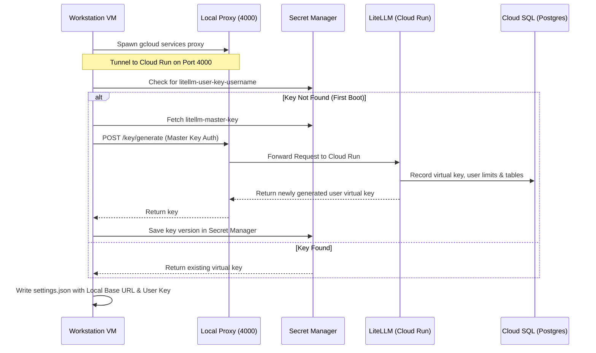

# 🛡️ Google Cloud Workstations: Secure Enterprise AI Developer Environments

This repository contains fully-functional, production-grade Terraform modules to provision a highly secure, fully-managed Google Cloud Workstations environment. 

It is designed to give developers access to premium AI-assisted development tools (like **Claude Code** and **Anti-gravity CLI**) within a **Zero Trust** network topology. It conditionally creates a brand new GCP project from scratch (including standard organization policy remediation) or deploys workstations directly into an existing GCP project.

---

## 🏗️ Architecture Overview

The workspace architecture employs multiple layer-3 and layer-7 security patterns to prevent data exfiltration, isolate workloads, centralize LLM credential management, and log all interactive terminal activity.

### GCP Architecture Diagram

The diagram below outlines the secure VPC topology, private service peering, secure serverless LLM egress, and dynamic authorization flow implemented by this codebase.

```mermaid
graph TB
    subgraph Client ["Client Access"]
        Dev["Developer"] -.->|HTTPS / SSH| WS_Cluster
    end

    subgraph GCP ["Google Cloud Project"]
        subgraph VPC ["Private VPC Network"]
            subgraph Private_Subnet ["Private Subnet (Private Google Access)"]
                WS_Cluster["Workstation Cluster"]
                
                subgraph WS_VM ["Workstation VM (No Public IP)"]
                    IDE["Code-OSS IDE"]
                    Claude["Claude Code & Anti-gravity CLI"]
                    Proxy["gcloud Run Proxy (Port 4000)"]
                    Audit["Audit Agent (command_logging.sh)"]
                    HomeDisk[("Persistent Home Disk (/home)")]
                end
            end

            subgraph Service_Networking ["Service Networking (VPC Peering)"]
                DB[("Cloud SQL PostgreSQL (litellm-postgres)")]
            end
        end

        subgraph Cloud_Run ["Serverless Egress"]
            LiteLLM["LiteLLM Proxy (Cloud Run v2)"]
        end

        subgraph Management ["Core Services & Security"]
            CloudBuild["Cloud Build"]
            Registry[("Artifact Registry (workstations-repo)")]
            SecretManager["Secret Manager (Configs & Keys)"]
            VertexAI["Vertex AI API (Claude & Gemini)"]
            CloudLogging["Cloud Logging (Container Stdout)"]
            NAT["Cloud NAT & Router (Secure Outbound)"]
        end
    end

    %% Connections
    Dev -->|Secure HTTPS Connection| IDE
    Claude -->|API Requests| Proxy
    Proxy -->|IAM-Authorized Tunnel| LiteLLM
    LiteLLM -->|Direct VPC Egress| DB
    LiteLLM -->|API Calls| VertexAI
    LiteLLM -->|Secret Resolution| SecretManager
    
    %% Startup Key Generation flow
    Proxy -.->|On Start: Generate or Fetch Key| SecretManager
    
    %% Outbound connections
    WS_VM -->|Private Google Access| SecretManager
    WS_VM -->|Private Google Access| Registry
    WS_VM -->|Outbound Web Requests| NAT
    NAT -->|Secure Egress| Internet["Public Internet (NPM, APIs)"]
    
    %% Command logging flow
    Audit -->|tail -F| CloudLogging
    
    %% Image build flow
    CloudBuild -->|Pulls Base & Builds| Registry
    WS_Cluster -->|Pulls Custom Image| Registry

    classDef gcp fill:#4285F4,stroke:#333,stroke-width:1px,color:#fff;
    classDef comp fill:#34A853,stroke:#333,stroke-width:1px,color:#fff;
    classDef db fill:#FBBC05,stroke:#333,stroke-width:1px,color:#333;
    classDef client fill:#EA4335,stroke:#333,stroke-width:1px,color:#fff;
    
    class GCP,VPC,Private_Subnet,Cloud_Run,Management,Service_Networking gcp;
    class WS_Cluster,WS_VM,IDE,Claude,Proxy,Audit,LiteLLM,CloudBuild,NAT,Registry,SecretManager,VertexAI,CloudLogging comp;
    class DB,HomeDisk db;
    class Dev client;
```



### 🔒 Architectural Pillars

1.  **Network Isolation (Zero Public IPs)**
    *   Workstation GCE VMs have **no public IP addresses** assigned.
    *   Outbound traffic to the internet (e.g., `npm install`, fetching third-party packages) is routed securely through a **Cloud Router** and **Cloud NAT** gateway.
    *   **Private Google Access** is enabled on the workstation subnetwork, allowing private VMs to resolve and reach Google APIs (Artifact Registry, Secret Manager, Cloud Logging) entirely within Google's backbone network.

2.  **Serverless LLM Proxy (LiteLLM on Cloud Run)**
    *   AI requests from workstations are centralized through an enterprise-managed **LiteLLM proxy** running on Google Cloud Run.
    *   LiteLLM is integrated with **Vertex AI** to access premium models (including Claude 3.5 Sonnet, Claude 3.5 Haiku, and Gemini 1.5 Pro) in a compliant manner.
    *   A completely private **Cloud SQL PostgreSQL** database is provisioned to track user usage, tokens, and virtual keys. It has no public IP and is peered directly to the VPC using Google's **Service Networking Connection**.
    *   Cloud Run connects to PostgreSQL using **Direct VPC Egress** and standard Cloud SQL volume mounts, preventing database exposure to the public internet.
    *   The Cloud Run proxy enforces strict access controls: only authorized GCP developer emails and the workstations service account can invoke the container (`roles/run.invoker`).

3.  **Local Sidecar Tunnel & Zero-Config AI Setup**
    *   To keep Vertex AI service accounts off developer workstations, each workstation container runs a background helper tool: the `gcloud run services proxy`. This mounts a secure tunnel to the centralized Cloud Run LiteLLM proxy onto the workstation's `localhost:4000`.
    *   During workstation boot, a startup script automatically talks to the local proxy to resolve or dynamically register a user-specific LiteLLM virtual key. The generated key is securely persisted in **Secret Manager** so that it survives workstation restarts.
    *   The startup script automatically provisions `~/.claude/settings.json` in the user's persistent `/home/user` directory, pre-configuring **Claude Code** to immediately run against the local proxy sidecar without manual authentication.

4.  **Terminal Auditing and Shell Logging**
    *   To comply with corporate security and auditing requirements, the custom workstation image features a system-wide terminal hook (`/etc/profile.d/command_logging.sh`) that intercepts and logs all terminal commands executed in Bash and Zsh.
    *   Logs are fed into `/var/log/shell_commands.log` along with timestamp, user ID, and process ID.
    *   A startup service streams this file to the workstation container’s primary stdout (`/proc/1/fd/1`), which Google **Cloud Logging** automatically collects and archives.

---

## 📂 Codebase Structure

```bash
gcp-workstations-tf/
├── main.tf                    # Root Terraform execution containing module orchestrations
├── variables.tf               # Global inputs (Project ID, region, user list, timeouts, etc.)
├── outputs.tf                 # Global outputs (Project ID, Cluster ID, Config ID)
├── terraform.tfvars.example   # Configuration template for user deployments
├── modules/
│   ├── project/               # GCP Project, service account creation, and API activation
│   ├── network/               # VPC, private subnets, Private Peering, Router & NAT
│   ├── litellm/               # Cloud Run LiteLLM Proxy, SQL database, configurations & IAM
│   └── workstations/          # Workstation Cluster, workstation configuration, and individual VMs
└── workstation-image/         # Docker container sources and boot startup scripts
    ├── Dockerfile             # Custom workstation image based on Code-OSS Predefined image
    ├── 010_command_logging.sh # Startup script establishing the shell logging stream
    ├── 020_litellm_proxy.sh   # Startup script establishing the local proxy and settings.json
    └── command_logging.sh     # System-wide Bash/Zsh prompt and hook command logger
```

---

## 🛠️ Prerequisites

Before executing the Terraform script, ensure you have the following tools and permissions:

| Prerequisite | Minimum Version / Scope | Purpose |
| :--- | :--- | :--- |
| **Terraform CLI** | `>= 1.0.0` | Provisions the entire infrastructure as code. |
| **Google Cloud CLI** | `>= 450.0.0` | Used to authenticate and build/push custom docker images. |
| **GCP Account & Billing** | Active Billing Account | Required to bind to the project to cover Compute and Cloud SQL costs. |
| **GCP IAM Permissions** | `roles/resourcemanager.projectCreator` | Required at organization or folder level if `create_project = true`. |
| **GCP Project IAM** | `roles/owner` | Required on target project if `create_project = false`. |

---

## 🚀 Setup & Deployment Guide

Follow these steps to deploy the workspace into your Google Cloud environment:

### 1. Authenticate with Google Cloud

Authenticate your terminal session and configure default application credentials so Terraform can act on your behalf:

```bash
gcloud auth login
gcloud auth application-default login
```

### 2. Configure Your Custom Variables

Copy the example configuration file to create your active configuration file:

```bash
cp terraform.tfvars.example terraform.tfvars
```

Open `terraform.tfvars` in your text editor and modify the parameters. Below is a detailed reference of the variables:

| Variable | Type | Default | Description |
| :--- | :--- | :--- | :--- |
| `create_project` | `bool` | `false` | Set to `true` to provision a brand-new GCP Project. |
| `project_id` | `string` | *(Required)* | The ID of the GCP Project (new or existing). |
| `billing_account_id` | `string` | `""` | The alphanumeric billing account ID (required if `create_project = true`). |
| `org_id` | `string` | `""` | The organization ID (optional, used if `create_project = true`). |
| `folder_id` | `string` | `""` | The folder ID (optional, used if `create_project = true`). |
| `region` | `string` | `"us-central1"` | GCP region to deploy the workstation cluster and networking. |
| `vertex_ai_location`| `string` | `"us-east5"` | Region hosting Vertex AI Claude models (e.g. `us-east5` or `europe-west9`). |
| `workstation_users` | `map(string)`| `{}` | Map of `workstation_id` (username) to Google developer email. |
| `litellm_master_key`| `string` | `"sk-...-1234"` | Secret key used to configure the centralized LiteLLM proxy admin. |
| `workstation_idle_timeout`| `string` | `"7200s"` | Inactivity period before VM automatically shuts down (e.g., 2 hours). |
| `workstation_running_timeout`| `string` | `"86400s"`| Maximum running time before workstation automatically shuts down (e.g., 24 hours). |

> [!TIP]
> Ensure user keys in `workstation_users` only contain lowercase letters, numbers, and dashes (e.g., `"john-doe" = "john.doe@enterprise.com"`). They must match Google Cloud's naming constraint: `^[a-z]([-a-z0-9]*[a-z0-9])?$`.

### 3. Deploy the Environment

Initialize the workspace and download necessary providers:

```bash
terraform init
```

Generate and inspect the execution plan to verify what resources will be created:

```bash
terraform plan
```

Apply the changes (this may take 10-15 minutes, primarily due to Cloud SQL database creation and initial container image compilation in Cloud Build):

```bash
terraform apply
```

On successful completion, Terraform outputs:
*   The actual `project_id` used.
*   The `workstation_cluster_id`.
*   The `workstation_config_id`.

---

## 🐳 Custom Workstation Container Image

A key feature of this repository is the seamless build workflow for the custom developer environment. 

The root `main.tf` features a `null_resource.build_custom_image` resource. It monitors the workstation image source folder. Any time you modify files in `workstation-image/`, Terraform detects the change using file checksums and automatically executes **Google Cloud Build** on apply:

```hcl
resource "null_resource" "build_custom_image" {
  triggers = {
    dockerfile = filemd5("${path.module}/workstation-image/Dockerfile")
  }

  provisioner "local-exec" {
    command = "gcloud builds submit ${path.module}/workstation-image --project=${module.project.project_id} --tag=${module.project.artifact_registry_url}/custom-workstation:latest"
  }
}
```

The custom image compiles the following components on top of the default Code-OSS template:
*   `google-cloud-cli-cloud-run-proxy`: Helper package for mounting secure Cloud Run tunnels.
*   `@anthropic-ai/claude-code`: Pre-installed globally.
*   `Anti-gravity CLI`: Pre-installed globally.
*   Terminal interception scripts for real-time shell auditing.

---

## 💻 Developer Guide: Using AI Assistants

Once provisioned, developers can immediately leverage pre-configured AI tools.

### 1. Launch & Connect
1.  Navigate to the **Cloud Workstations** console in Google Cloud.
2.  Select the cluster and config provisioned by Terraform.
3.  Locate your workstation and click **Start**, then **Launch**.
4.  Your browser opens into a web-based Code-OSS (VS Code) interface, or you can connect via SSH from your local IDE.

### 2. How the Startup Script Configures Claude Code
During container boot, the `/etc/workstation-startup.d/020_litellm_proxy.sh` script runs automatically:



### 3. Running Claude Code
Since `settings.json` is generated dynamically, developers can open the workstation terminal and run:

```bash
claude
```

Claude Code starts instantly, pre-authorized and pre-routed. It communicates locally with `http://localhost:4000`, which the sidecar tunnel encrypts and forwards to the central LiteLLM proxy, accessing GCP Vertex AI backends securely.

---

## 🔒 Security Auditing and Compliance

The environment incorporates active compliance auditing that ensures all user terminal action is preserved.

### How Terminal Auditing Works
1.  The file `/etc/profile.d/command_logging.sh` installs precmd (Zsh) and PROMPT_COMMAND (Bash) triggers.
2.  Each completed interactive terminal line is instantly logged to `/var/log/shell_commands.log`.
3.  The startup script `/etc/workstation-startup.d/010_command_logging.sh` spawns a non-blocking `tail -F` stream to the container's PID 1 stdout.
4.  Because the VM agent forwards container stdout, everything appears in **Google Cloud Logging** instantly.

### Querying Command Logs
Security administrators can audit terminal command history from the Google Cloud Console. Go to **Logs Explorer** and use the following query:

```logql
resource.type="workstation_cluster"
jsonPayload.message =~ "USER="
```

Example Log Output:
```json
{
  "insertId": "1b2c3d4e5f...",
  "jsonPayload": {
    "message": "2026-05-26T13:20:00Z USER=user WORKSTATION=workstations-cluster-john-doe PID=15243: rm -rf /tmp/sensitive-data"
  },
  "resource": {
    "type": "workstation_cluster",
    "labels": {
      "project_id": "my-workstations-project",
      "location": "us-central1",
      "workstation_cluster_id": "workstation-cluster"
    }
  },
  "timestamp": "2026-05-26T13:20:00.123456Z"
}
```

---

## 🔧 Troubleshooting & Maintenance

### 1. Rebuilding the Workstation Image
If you edit the files in `workstation-image/` (e.g. updating a package version in `Dockerfile`), simply run:

```bash
terraform apply
```

The file hash trigger executes a rebuild on Cloud Build and updates the image. For existing active workstations to receive the update, they must be stopped and restarted in the console to pull the `latest` image.

### 2. Debugging Local Sidecar Tunnels
If Claude Code fails to connect or reports API Key issues inside the workstation, check the sidecar proxy status:

1.  Inspect the local proxy startup log:
    ```bash
    cat /var/log/litellm_proxy.log
    ```
2.  Verify the sidecar tunnel port is open and listening:
    ```bash
    curl -i http://localhost:4000/ping
    ```
3.  Verify the presence of the Claude configuration file:
    ```bash
    cat ~/.claude/settings.json
    ```

### 3. Cloud SQL Peering Delay
On initial deployment, GCP Private Service Peering connection can occasionally take a couple of minutes to propagate. If Cloud Run fails its initial startup health check because it cannot reach the Postgres database, wait 2-3 minutes and execute `terraform apply` again; the connection will heal and complete the service configuration.

---

## 📄 License

This repository is licensed under the Apache License 2.0. See [LICENSE](LICENSE) for details.
